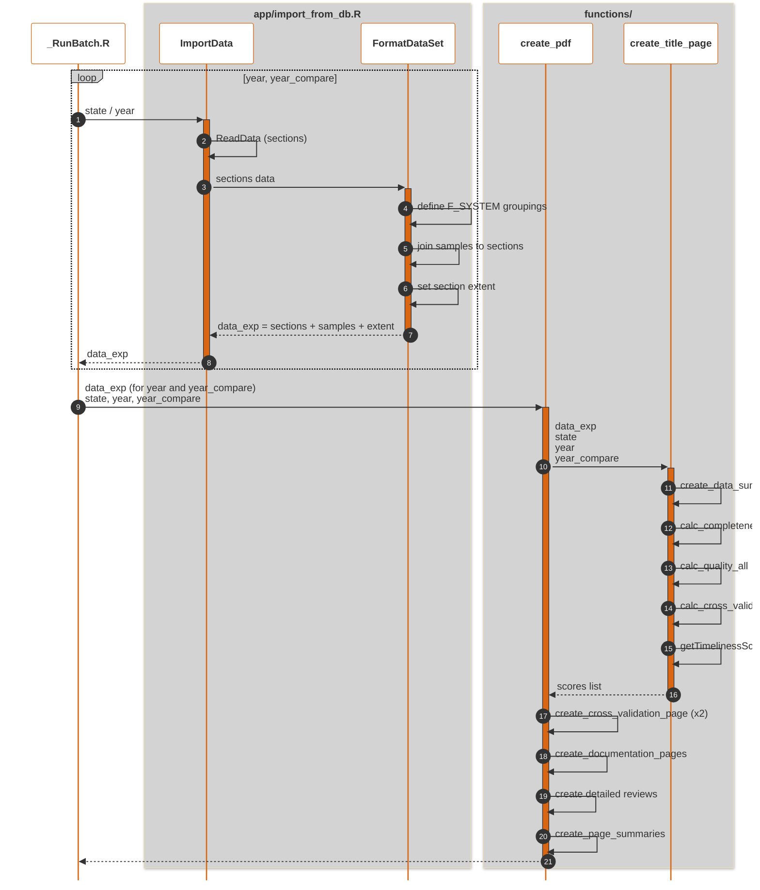

## Sequence of key steps

```mermaid


%%{init: {'sequence': { 'mirrorActors': false, 'rightAngles': true, 'messageAlign': 'left', 'actorFontSize': 30, 'numberFontSize': 20, 'actorFontWeight': 900, 'noteFontSize': 24, 'noteFontWeight': 600, 'messageFontSize': 18}}}%%
%%{init: {'theme': 'base', 'themeVariables': {'labelBoxBkgColor': 'lightgrey', 'labelBoxBorderColor': '#000000', 'actorBorder': '#D86613', 'actorBkg': '#ffffff', 'activationBorderColor': '#232F3E', 'activationBkgColor': '#D86613', 'noteBkgColor': 'rgba(255, 153, 0, .25)', 'noteBorderColor': '#232F3E'}}}%%
sequenceDiagram
    participant _RunBatch as <br /> _RunBatch.R <br />

    box lightgrey app/import_from_db.R
        participant ImportData as <br />ImportData<br />
        participant FormatDataSet as <br />FormatDataSet<br />
    end
    
    box lightgrey functions/
    participant create_pdf as <br />create_pdf<br />
    participant create_title_page as <br />create_title_page<br />
    %%%participant permissions as <br />AWS IAM<br />policy
    end

box left of _RunBatch: 
end 
autonumber
    %%% note over _RunBatch: Note: the import sequence runs twice <br />first for the data year <br />then again for the comparison year
    loop year, year_compare
    _RunBatch ->>+ ImportData: state / year 
        ImportData ->> ImportData: ReadData (sections)

        ImportData ->>+ FormatDataSet: sections data
            FormatDataSet ->> FormatDataSet: define F_SYSTEM groupings
            FormatDataSet ->> FormatDataSet: join samples to sections
            FormatDataSet ->> FormatDataSet: set section extent
        FormatDataSet -->>- ImportData: data_exp = sections + samples + extent
    ImportData -->>- _RunBatch: data_exp 
    end

    _RunBatch ->>+ create_pdf: data_exp (for year and year_compare) <br /> state, year, year_compare
        create_pdf ->>+ create_title_page: data_exp <br /> state <br /> year <br /> year_compare
            create_title_page ->> create_title_page: create_data_summary
            create_title_page ->> create_title_page: calc_completeness_all
            create_title_page ->> create_title_page: calc_quality_all
            create_title_page ->> create_title_page: calc_cross_validations
            create_title_page ->> create_title_page: getTimelinessScore
        create_title_page -->>- create_pdf: scores list

        create_pdf ->> create_pdf: create_cross_validation_page (x2)
        create_pdf ->> create_pdf: create_documentation_pages
        create_pdf ->> create_pdf: create detailed reviews
        create_pdf ->> create_pdf: create_page_summaries
    create_pdf -->>- _RunBatch: 

    
```

